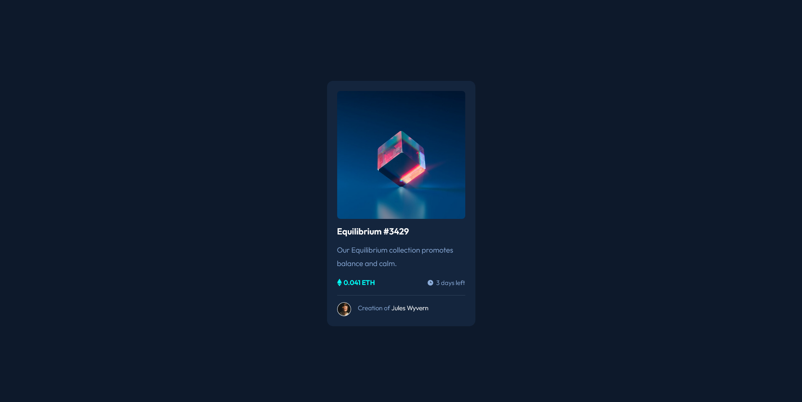

# Frontend Mentor - NFT preview card component solution

This is a solution to the [NFT preview card component challenge on Frontend Mentor](https://www.frontendmentor.io/challenges/nft-preview-card-component-SbdUL_w0U). Frontend Mentor challenges help you improve your coding skills by building realistic projects.

  
## Table of contents

- [Overview](#overview)

- [The challenge](#the-challenge)

- [Screenshot](#screenshot)

- [Links](#links)

- [Built with](#built-with)

- [Author](#author)

  

## Overview

A simple and short project for learning the basics of CSS and getting to know the flexbox or grid.
  

### The challenge

The main task was to code the nft card and get a design as similar as possible to the given design. The project has no technology limitations, so it is possible to use any of it. An ideal task for learning and exploring new possibilities.

Users should be able to:

- View the optimal layout depending on their device's screen size
- See hover states for interactive elements

  
### Screenshot

### Links

- Solution URL: https://github.com/dcosic94/nft-preview-card-component

- Live Site URL: https://dcosic94.github.io/nft-preview-card-component

### Built with

- Semantic HTML5 markup

- CSS custom properties

- Flexbox

- Mobile-first workflow

## Author

- Website - [Raw Digital](https://rawdigital.hr)

- Frontend Mentor - [@dcosic94](https://www.frontendmentor.io/profile/dcosic94)
  